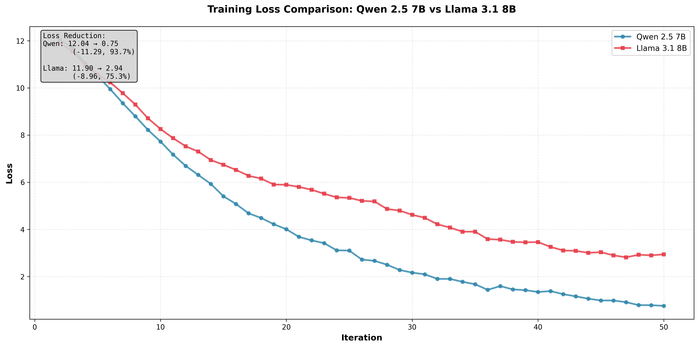

# Internal Development Report 01

**Report Date:** December 11, 2025  
**Engineer:** Dmitrii Nikolaev  
**Project:** Support preparation for training customer cases on AMD Instinct MI300X

---

## Executive Summary

This report documents the first week of development activities focused on establishing a training environment using Primus on AMD Instinct MI300X GPUs. The week involved initial setup, environment configuration, and baseline training runs for two large language models: Llama 3.1 8B and Qwen 2.5 7B.

**Key Achievements:**

- ✅ Successfully configured development environment and access credentials
- ✅ Deployed ROCm/Primus Docker container on MI300X cluster
- ✅ Completed baseline training runs for Llama 3.1 8B and Qwen 2.5 7B
- ✅ Generated comparative performance analysis and visualizations

---

## Initial Setup and Configuration

**GitHub Configuration:**

- Registered primary email: `Dmitrii.Nikolaev@amd.com`

- Registered secondary email: `dmnikola@amd.com`

- Added SSH public key for secure access:

  ```
  ssh-ed25519 AAAAC3NzaC1lZDI1NTE5AAAAIIvgxH4rA0uItJy/vvotxd+Kb8I9SbgswJ8ukiLjqvWK
  ```

**Docker Registry Access:**

- Configured shared Docker account for accessing ROCm images
- Successfully authenticated to Docker Hub with`rocmshared`

**HuggingFace Access:**

- Generated HuggingFace access token for model downloads
- Obtained permission for Meta's Llama 3.1 models & evaluations
- Token configured for automated model retrieval

**Infrastructure:**

- Platform: AMD Instinct MI300X cluster (SLURM-managed)
- Head node: `tw-head`
- Compute node used: `tw028` / `tw030` / `tw0306`

**Resource Allocation:**

```bash
# Session management with tmux
tmux new -t primus_dmnikola

# Resource allocation via SLURM
salloc -J primus_dmnikola -t 08:00:00
```

---

## Environment Setup

| Specification          | Value                 |
| ---------------------- | --------------------- |
| Architecture           | CDNA 3                |
| HBM3 Memory            | 192 GB                |
| Memory Bandwidth       | Up to 5.3 TB/s        |
| Peak Performance (FP8) | 2.6+ PFLOPs           |
| Launch Date            | December 6, 2023      |
| Target Applications    | AI, HPC, LLM Training |

**Base Docker Image:** `rocm/primus:v25.10`

**Container Launch Configuration:**

```bash
docker run -it \
    --device /dev/dri \
    --device /dev/kfd \
    --device /dev/infiniband \
    --network host --ipc host \
    --group-add video \
    --cap-add SYS_PTRACE \
    --security-opt seccomp=unconfined \
    --privileged \
    -v $HOME:$HOME \
    --shm-size 128G \
    --name primus_training_env \
    rocm/primus:v25.10
```

**AMD-specific environment variables configured:**

```bash
export HSA_NO_SCRATCH_RECLAIM=1
export HSA_ENABLE_SDMA=1
export HF_TOKEN=xxx
```

---

## Training Experiments

### Llama 3.1 8B Pretraining

```bash
EXP=examples/megatron/configs/MI300X/llama3.1_8B-pretrain.yaml \
bash ./examples/run_pretrain.sh \
    --train_iters 50 \
    --fp8 hybrid \
    --micro_batch_size 1 \
    --global_batch_size 128
```

- **Initial Loss:** 11.90
- **Final Loss:** 2.94
- **Loss Reduction:** 8.96 (75.3% improvement)
- **Time per Iteration:** ~9,873.9 ms
- **Samples Processed:** 6,400
- **Total Training Time:** ~8.2 minutes
- **GPU Memory Usage:** 118.03 GB / 191.98 GB (61.48%)

Training was smooth and stable with consistent memory utilization. To fit into memory I had to tune micro_batch_size and --global_batch_size params.

### Qwen 2.5 7B Pretraining

```bash
EXP=examples/megatron/configs/MI300X/qwen2.5_7B-pretrain.yaml \
bash ./examples/run_pretrain.sh \
    --train_iters 50 \
    --fp8 hybrid \
    --micro_batch_size 4 \
    --global_batch_size 512
```

- **Initial Loss:** 12.04
- **Final Loss:** 0.75
- **Loss Reduction:** 11.29 (93.7% improvement)
- **Average Throughput:** 686.8 TFLOP/s/GPU
- **Average Tokens/s/GPU:** 15,303.5
- **Time per Iteration:** ~8,565.1 ms
- **Samples Processed:** 25,600
- **Total Training Time:** ~7.1 minutes
- **GPU Memory Usage:** 114.79 GB / 191.98 GB (59.79%)

Much beeter training convergence with smooth loss reduction and higher token throughput due to larger batch size, significantly better final loss (0.75) and more efficient memory usage (59.79% vs 61.48%).

---

## Conclusions




Qwen 2.5 7B was faster, first iteration takes anomalously long for both models (initialization, loading), after the second iteration, time stabilizes and remains nearly constant. Ffter servers restoration, SLURM integration worked seamlessly, ensuring smooth cluster job management and resource allocation. Training performance was highly efficient and stable across all tests. Qwen achieved better convergence and throughput, largely due to its larger global batch size. The use of FP8 hybrid precision proved effective, delivering excellent computational performance with minimal accuracy trade-offs. Both models demonstrated strong memory efficiency, utilizing less than 62% of available GPU memory, leaving ample capacity for scaling to larger models. ROCm showed robust stability throughout the process, with no driver issues or GPU errors encountered. 
